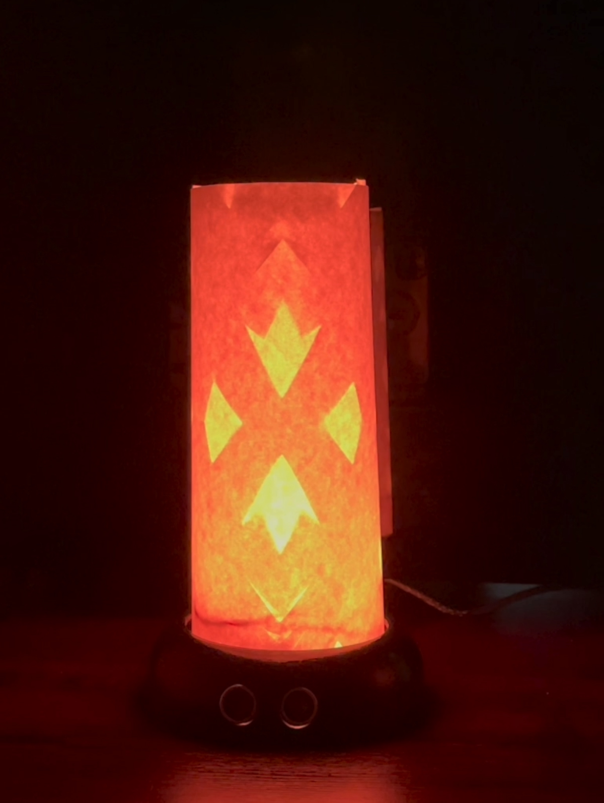

# Long-Distance Lamp

[](https://vimeo.com/490253318)


This project is a solution that provides long-distance couples with a communication tool outside of our standard text or voice-based communications. Two lamps use an [ESP8266 WiFi Module](https://www.sparkfun.com/products/17146) connected to [Arudino's IoT Cloud](https://www.arduino.cc/en/IoT/HomePage), storing a color variable formatted as a string: 
```cpp
    String color = R + "," + G + "," + B;
```
Each lamp uses an [HC-SR04 Ultrasonic Distance Sensor](https://www.sparkfun.com/products/15569) to activate a light, a [NeoPixel 12-LED Ring](https://www.adafruit.com/product/1643) or [RGB LED](https://www.sparkfun.com/products/11120), with the most recent color when the distance from the sensor is less than 30 centimeters.

# Parts
## Hardware
- [Arduino Uno](https://www.sparkfun.com/products/11021)
- [ESP8266](https://www.sparkfun.com/products/17146)
- [HC-SR04 Ultrasonic Distance Sensor](https://www.sparkfun.com/products/15569)
- [NeoPixel 12-LED Ring](https://www.adafruit.com/product/1643) or [RGB LED](https://www.sparkfun.com/products/11120)
## Software
- [Arduino IDE](https://www.arduino.cc/en/software)
- [Arduino IoT Cloud Account](https://www.arduino.cc/en/IoT/HomePage)
- [Node.js and npm](https://docs.npmjs.com/downloading-and-installing-node-js-and-npm)
- [Arduino IoT Cloud's API](https://www.npmjs.com/package/@arduino/arduino-iot-client)
- [Three JS](https://www.npmjs.com/package/three)
- [Three OBJ and MTL loaders](https://www.npmjs.com/package/three-obj-mtl-loader)
- [require-promise](https://www.npmjs.com/package/require-promise)
- [browserify](https://www.npmjs.com/package/browserify)
# The Circuit


The left image shows a breadboard schematic for the lamp with the NeoPixel 12-LED Ring, and the right image shows the breadboard for the lamp with the RGB LED.

The HC-SR04 has 4 pins: VCC, ECHO, TRIG, and  GND. The VCC and GND pins are connected to the Arduino's 5V and GND pins to supply power to the sensor. The ECHO and TRIG pins are connected to pins 5 and 6 on the Arduino, respectively. The LED Ring receives data from pin 9, along with 5V and GVD. Opting for the standard RGB LED maps R, G, and B to pins 9, 10, and 11. The ESP's RX and TX pins communicate with the Arduino through pins 2 and 3, respectively. The EN, RST, and 3V3 pins are all connected to 3.3V, and GND is connected to GND; however, uploading code to the ESP requires a different circuitry. [When uploading code](https://create.arduino.cc/projecthub/Niv_the_anonymous/esp8266-beginner-tutorial-project-6414c8#toc-esp8266-pinout-1), the IO0 pin needs to be connected to GND, and RX and TX connected to the Arduino's RX and TX. This allows the ESP to read serial communication from a USB connection instead of the Arduino. Additionally, the Arduino's RST pin should be connected to GND, or its ATMEGA328P chip must be removed to allow the code to pass through to the ESP. With all of this together, I struggled to get code to upload until I connected the ESP's RST to GND until the "Connecting ..." message appears in the console. To make this a little easier during the development process, I put two buttons on a breadboard, one between IO0 and GND and the other between RST and GND.


# ESP8266
Setting up a "thing" and property on my IoT cloud account provides a template for the code the ESP will use. A thingProperties header file includes the IoT [library](https://github.com/arduino-libraries/ArduinoIoTCloud) to initialize the ```color``` variable and its ```onColorChange()``` function. Adding the ESP's WiFi, WebServer, and mDNS [libraries](https://github.com/esp8266/Arduino/tree/master/libraries) to the .ino file gives the ESP the ability to serve a web page on its local network, and [LittleFS](https://arduino-esp8266.readthedocs.io/en/latest/filesystem.html) gives the ability to upload files to the ESP. WiFi and secret variables are stored in a secret header file.
## ESP's [.ino file](final-esp/final-esp.ino)
The ESP's [server capability](https://lastminuteengineers.com/creating-esp8266-web-server-arduino-ide/) is initialized with

```cpp
    ESP8266WebServer server(80);
```

Next, the functions for each client request are initialized

```cpp
    void handleRoot();
    void handleNotFound();
    void handleObjFile();
    void handleMtlFile();
    void handleColor();
```
### ```setup()``` | [final-esp.ino](final-esp/final-esp.ino)
In the ``` setup() ``` function, Serial communication begins with a speed of 115200 baud. The WiFi connection starts in station mode to serve on the local WiFi network. An mDNS hostname is started to use lamp.local to connect; however, this method is not supported in all browsers, so the local IP address is printed to the Serial. ``` initProperties() ``` is provided by Arduino to initialize the properties from the thing properties header file. ```LittleFS.begin()``` gives access to the file system. The server is set up to handle requests related to the functions above:

```cpp
    server.on("/", handleRoot);
    server.on("/lampBase.obj", handleObjFile);
    server.on("/lampBase.mtl", handleMtlFile);
    server.on("/setColor", handleColor);
    
    server.onNotFound(handleNotFound);
    server.begin();
```

### Server Request Handlers | [final-esp.ino](final-esp/final-esp.ino)
These functions are defined as follows, using LittleFS to get the ESP's file system. The tool to upload files and its installation process is detailed in the [ESP's docs](https://arduino-esp8266.readthedocs.io/en/latest/filesystem.html#uploading-files-to-file-system). I found the server's ```streamFile()``` in this [ESP8266 guide](https://tttapa.github.io/ESP8266/Chap12%20-%20Uploading%20to%20Server.html).

```cpp
    void handleRoot() {
    File index = LittleFS.open("/index.html", "r");
    server.streamFile(index, "text/html");
    index.close();
    }

    void handleColor() { // the browser will send a GET request with r, g, and b 
    color = server.arg("r") + "," + server.arg("g") + "," + server.arg("b");
    onColorChange();
    server.sendHeader("Location", "/");
    server.send(303);
    }

    void handleMtlFile() {
    File mtl = LittleFS.open("/lampBase.mtl", "r");
    server.sendHeader("Cache-Control", "public, max-stale=600, immutable");
    server.streamFile(mtl, "model/mtl");
    mtl.close();
    }

    void handleObjFile() {
    File obj = LittleFS.open("/lampBase.obj", "r");
    server.sendHeader("Cache-Control", "public, max-stale=600, immutable");
    server.streamFile(obj, "model/obj");
    obj.close();
    }

    void handleNotFound() {
    server.send(404, "text/plain", "404: Not Found");
    }
```
The [MDN docs](https://developer.mozilla.org/en-US/docs/Web/HTTP/Headers) layout the use of HTTP headers. Without setting the cache control on the MTL and OBJ files, they reload every time the color is updated. 

When the browser sends a request to set the color, ```onColorChange()``` is called to print the formatted color to the Serial.

### ```loop()``` | [final-esp.ino](final-esp/final-esp.ino)

The ```loop()``` function uses the IoT cloud's update method to update the cloud variable. This is supposed to work to both read and write the value; however, we were only seeing it work as a read of the cloud's value, as we saw an update when changing it on the IoT Dashboard, but we did not see an update on the dashboard when updating it locally. Implementing their npm package and controlling the read and write processes with two separate functions, [```getColor()```](#getcolor--mainjs) and [```updateColor()```](#updatecolor--mainjs), in JS, worked for keeping the variable in sync regardless of where it is (re)defined.

The complete final-esp.ino file can be found [here](final-esp/final-esp.ino)

## ESP's [index.html](web/index.html)
The web page for updating colors is defined in an HTML document with a section for a Three JS scene, a color input, and the local times in both time zones. It calls for the bundle.js file to produce the Three JS scene and connect to the IoT cloud.

```html
    <section id="threeScene"></section>
    <section id="buttons">
        <input type="color" id="colorPicker" value="#FF0000">
    </section>
    <section id="time1" class="time">
        <h1>Patrick</h1>
        <h2>11:59 PM</h2>
        <h3>Johnson City, TN</h3>
    </section>
    <section id="time2" class="time">
        <h1>Hunter</h1>
        <h2>11:59 PM</h2>
        <h3>London, UK</h3>
    </section>
    <script src="https://creative.colorado.edu/~pama4904/object/lamp/bundle.js"></script>
```
### CSS | [index.html](web/index.html)
To keep things simple, our CSS is included in a ```style``` tag in index.html

```css
    body {
        margin: 0;
    }

    section {
        position: fixed;
        top: 0;
        left: 0;
    }

    .time {
        bottom: 30px;
        top: auto;
        font-family: Helvetica, Arial, sans-serif;
        color: #fff;
    }

    #time1 {
        left: 30px;
    }

    #time2 {
        right: 30px;
        left: auto;
        text-align: right;
    }

    #colorPicker {
        margin: 30px;
        width: 100px;
        height: 100px;
    }
```

The complete index.html file can be found [here](web/index.html).

## ESP's [bundle.js](web/bundle.js)
bundle.js is the result of using browserify to bundle our main.js and node modules. It is hosted on creative.colorado because the file size is a too large for the memory of the ESPs we purchased. Additionally, this makes debugging much simpler as updating the JavaScript for the lamp doesn't require the ESP's upload process.

## ESP's [main.js](web/main.js)
main.js is where the magic happens. First, you'll want to make sure you have node and [npm](https://www.npmjs.com) installed. I'm working on macOS and prefer the [hyper terminal](https://hyper.is) and [fish shell](https://fishshell.com) for work like this as they provide great customization and autocomplete features; however, you can accomplish this in whichever environment pleases you. 
```fish
    node -v
    npm -v
```
I've previously installed these, but if the above commands don't return anything, you'll need to follow npm's [instructions](https://docs.npmjs.com/downloading-and-installing-node-js-and-npm) on installing node and npm. Alternatively, homebrew provides a [command](https://formulae.brew.sh/formula/node#default) to install node and npm.
```fish
    brew install node
```
### Setting up npm | [main.js](web/main.js)
The first step is to create a package.json file with the ```npm init``` command. Going through this set up is pretty straight forward, but I'm setting the entry point to main.js out of habit. The standard index.js is fine, or anything else you'd like, but you'll need to name your file accordingly.

Additionally, the following packages need to be installed and then required in main.js.

[Arduino's IoT API Client ](https://www.npmjs.com/package/@arduino/arduino-iot-client) is used to connect to the IoT cloud and sync the color variable. This brings request-promise with it for retrieving an OAuth2 access token.
```fish
    npm i @arduino/arduino-iot-client
```
```js
    const IotApi = require("@arduino/arduino-iot-client");
    const rp = require("request-promise");
```

[three](https://www.npmjs.com/package/three) is used to render a 3D animation of the lamp
```fish
    npm i three
```
```js
    const THREE = require("three");
```
[three obj/mtl loader](https://www.npmjs.com/package/three-obj-mtl-loader) gives three js loaders for .obj and .mtl files
```fish
    npm i three-obj-mtl-loader
```
Looking at this package's index.js (node_modules/three-obj-mtl-loader/index.js) file shows the exports at the very bottom. It exports an object with an ```MTLLoader``` property and an ```OBJLoader``` property.
```js
    const loaders = require("three-obj-mtl-loader");
    const MTLLoader = loaders.MTLLoader;
    const OBJLoader = loaders.OBJLoader;
```
### ```getToken()``` | [main.js](web/main.js)
After requiring all of these packages, I define a ```getToken()```  function to get an OAuth2 access token to authenticate our IoT cloud interactions. This is detailed in the [Cloud API's npm Documentation](https://www.npmjs.com/package/@arduino/arduino-iot-client); however, I struggled with a CORS Access Control error for a while. I found [this Medium Article](https://medium.com/@dtkatz/3-ways-to-fix-the-cors-error-and-how-access-control-allow-origin-works-d97d55946d9) that provides a proxy, cors-anywhere.herokuapp.com, to receive requests and send a response without any CORS errors. For the sake of convenience and time, I'm going to continue with this proxy; however, when moving on to another iteration of this product, I would want to serve this proxy from my server instead to avoid the cors-anywhere's rate limit.

```js
const getToken = async () => {
    let options = {
        method: "POST",
        url: "https://cors-anywhere.herokuapp.com/https://api2.arduino.cc/iot/v1/clients/token ",
        headers: { "content-type": "application/x-www-form-urlencoded", "Access-Control-Allow-Origin": "*" },
        json: true,
        form: {
            grant_type: "client_credentials",
            client_id: process.env.CLIENTID,
            client_secret: process.env.CLIENTSECRET,
            audience: "https://api2.arduino.cc/iot "
        }
    };
    try {
        const response = await rp(options);
        return response["access_token"];
    } catch (error) {
        console.log("Failed getting an access token: " + error);
    }
}
```

### ```getColor()``` | [main.js](web/main.js)
This function is called in a ```getColor()``` function. before getting the IoT cloud's color variable value. The process required for this is detailed in the [Cloud API's documentation](https://www.arduino.cc/reference/en/iot/api/#api-PropertiesV2-propertiesV2Show). This function will use a few global variables:

```js
    let threeStarted = false;
    let userColor;
    let api = null;
    let deviceID = process.env.DEVICEID;
    let thingID = process.env.THINGID;
    let propertyID = process.env.PROPID;
    let lastWebColor = "";
```

The device and thing IDs are available in the Arduino IoT Cloud account. The property ID is obtained with ```console.log(data)```, where data is the response from the [propertiesV2List method](https://www.arduino.cc/reference/en/iot/api/#api-PropertiesV2-propertiesV2List).

First, the ```getColor()``` function checks if the ```api``` variable is still null. If so, it requests an access token and defines an IoT ```PropertiesV2Api```. 

```js
if (api == null) {
    const client = IotApi.ApiClient.instance;
    const oauth2 = client.authentications["oauth2"];
    oauth2.accessToken = await getToken();
    api = new IotApi.PropertiesV2Api();
}
```

Next, this ```api```'s ```propertiesV2Show``` method is used to "show" the property's value, in this case, the value of the ```color``` variable. The ```api``` returns an object with a property ```last_value```, which holds the last value the IoT Cloud recorded. This value is formatted as an RGB string to define a ```new THREE.Color```. Again, I ran into the CORS error with this API method, but looking at the ApiClient.js file in node_modules/@arduino/arduino-iot-client/dist, I found a ```this.basePath``` variable storing the base URL. Prepending this URL with the cors-anywhere.herokuapp.com URL solves the problem.
```js
api.propertiesV2Show(thingID, propertyID).then(data => {
    let val = data.last_value;
    let lastCloudColor = "rgb(" + val + ")";
    userColor = new THREE.Color(lastCloudColor);
})
```

The HTML color input's value needs to be changed as well, but it uses HEX instead of RGB. I found [this function](https://stackoverflow.com/questions/5623838/rgb-to-hex-and-hex-to-rgb) to do the conversion. 

Next, the function uses the ```threeStarted``` variable to initialize the three scene if it hasn't done so already. If the three scene has started, the function compares the previous and current colors. If they are different, it updates the scene's lighting and material and informs the ESP of an updated color with the ```tellESP()``` function.

```js
    if (!threeStarted) {
        initThree();
        threeStarted = true;
        lastWebColor = val;
    } else if (val != lastWebColor) {
        pointLight.color = userColor;
        ambientLight.color = userColor;
        cylinder.material.color = userColor;
        lastWebColor = val;
        tellESP(rgbObject);
    }
```

After calling ```getColor();``` on startup, this function runs on a 10-second interval, relying on the ```threeStarted``` boolean and a ```waiting``` boolean that tells if we are waiting on a successful update from the browser to the IoT cloud. This ensures we don't overwrite the color locally until we're sure it is stored in the cloud. 

```js
    let syncCloudColor = setInterval(() => {
    if (!waiting && threeStarted) {
        getColor();
    }
}, 10000);
```
### ```tellESP()``` | [main.js](web/main.js)

The ```tellESP()``` function is how we ensure the local lamp's color always stays current, whether changed locally or remotely. It receives the color as an object with three properties: r, g, and b. It then formats this object into a URL path with three parameters and opens an [XML HTTP GET](https://developer.mozilla.org/en-US/docs/Web/API/XMLHttpRequest/open) request at this URL path. This sends the color to the ESP, where it is then printed to the Serial.

```js
    const tellESP = (rgbObj) => {
        let url = `/setColor?r=${rgbObj.r}&g=${rgbObj.g}&b=${rgbObj.b}`;
        let xhr = new XMLHttpRequest();
        xhr.open("GET", url, true);
        xhr.send();
    }
```
### ```colorPicker.addEventListener()``` | [main.js](web/main.js)
Sending an updated color to the IoT Cloud begins when a user selects a color with the color input's picker. I use an event listener to know when this happens and trigger the update. This immediately updates the lights and material in the three scene and calls ```updateLight()``` to begin the update process. ```updateLight()``` begins by taking the HEX value of the color picker and converting it to RGB. I found a [function for this](https://stackoverflow.com/questions/5623838/rgb-to-hex-and-hex-to-rgb) along with the previous function I used to convert the other way.

```js
    const colorPicker = document.getElementById("colorPicker");
    colorPicker.addEventListener("input", () => {
        userColor = new THREE.Color(colorPicker.value);
        pointLight.color = userColor;
        ambientLight.color = userColor;
        cylinder.material.color = userColor;
        updateLight(colorPicker.value);
    });
```

### ```updateLight()``` | [main.js](web/main.js)
After the ```updateLight()``` has converted the HEX value to RGB, the ```waiting``` variable switches to ```true```, and ```tellESP``` is called with the RGB object. The ```syncCloudColor```'s interval is cleared, and an ```updateColor()``` function is called with an RGB string from the RGB object. After ```updateColor()``` is finished, the interval is reset to call ```getColor()``` every 10 seconds.

```js
    let updateLight = (color) => {
        let rgb = toRGB(color);
        rgbString = rgb.r + "," + rgb.g + "," + rgb.b;
        waiting = true;
        tellESP(rgb);
        clearInterval(syncCloudColor);
        updateColor(rgbString).then(() => {
            syncCloudColor = setInterval(() => {
                if (!waiting && threeStarted) {
                    getColor();
                }
            }, 10000);
        });
    }
```

### ```updateColor()``` | [main.js](web/main.js)
The ```updateColor()``` function sends an RGB color as a comma-separated string to the IoT Cloud's color variable. Using the API's [propertiesV2Publish()](https://www.arduino.cc/reference/en/iot/api/#api-PropertiesV2-propertiesV2Publish) method. Once the color is sent, the ```waiting``` boolean is set back to ```false```.

```js
    const updateColor = async (thisColor) => {
        let propertyVal = {
            "device_id": deviceID,
            "value": thisColor
        }
        api.propertiesV2Publish(thingID, propertyID, propertyVal).then(() => {
            // once the update is done, we're no longer waiting
            waiting = false;
            console.log("Color updated");
        }, error => {
            console.log("Failed to update color: " + error);
        });
    }
```

### ```initThree()``` | [main.js](web/main.js)

A [Three.js scene](https://threejs.org) controls the visual content of the web page. The scene creation is wrapped in the ```initThree()``` function to ensure it is not initialized until the current color is loaded. First, the ```scene``` is defined as a ```new THREE.Scene()```. Point and ambient lights are added to light the scene with the current color. The point light acts like a lightbulb and is positioned above the lamp's position to create the best visual effect. The max distance is set at 200 more than the ```y``` position to emit light just a little past the lamp, and the decay is set to 2 to provide physically correct lighting. The ambient serves to provide, as its name suggests, ambient light to the scene, lighting all elements equally.

```js
    let initThree = () => {
        scene = new THREE.Scene();

        pointLight = new THREE.PointLight(userColor, 10, 1200, 2);
        pointLight.position.set(0, 1000, 0);
        pointLight.castShadow = true;
        scene.add(pointLight);

        ambientLight = new THREE.AmbientLight(userColor);
        scene.add(ambientLight);
```

A perspective camera is used to display the scene in the browser, and the renderer is set up using the window's width and height and the device's pixel ratio. It is then attached to the ```<section id="threeScene">``` HTML element in index.html

```js
        let w = window.innerWidth;
        let h = window.innerHeight;

        camera = new THREE.PerspectiveCamera(75, w / h, 0.1, 1000);
        camera.position.z = 5;

        renderer = new THREE.WebGLRenderer({ antialias: true });
        renderer.setSize(w, h);
        renderer.setPixelRatio(window.devicePixelRatio);
        renderer.setClearColor(0x777777, 1);
        document.getElementById("threeScene").appendChild(renderer.domElement);
```

The lampshade is the first object that is created. A mesh combines geometry and material, so this begins with a ```CylinderGeometry``` and the ```MeshBasicMaterial``` to create the cylinder's mesh. The Mesh Basic Material is used to keep the cylinder matte and non-reflective.

```js
        const geometry = new THREE.CylinderGeometry(1.2, 1.2, 3.5, 32, 4, false);
        const material = new THREE.MeshBasicMaterial({ color: userColor, transparent: true, opacity: 0.7, });
        cylinder = new THREE.Mesh(geometry, material);
        scene.add(cylinder);
```

A plane is added behind the lamp with a Mesh Phong Material to act as a wall that reflects the scene's light.

```js
        const bgGeometry = new THREE.PlaneGeometry(100, 100);
        const bgMaterial = new THREE.MeshPhongMaterial({ color: 0x777777 });
        const bg = new THREE.Mesh(bgGeometry, bgMaterial);
        bg.position.z = -10;
        scene.add(bg);
```

Finally, the lamp base is added using the OBJ and MTL loaders from the three-obj-mtl-loader package. First, the two loaders are defined. The MTL file is then loaded and used in the OBJ loader's ```setMaterials``` method to load the OBJ file. Then, I just had to scale it down to a quarter of its size and rotate it to the correct position.

```js
        let base;
        const loader = new OBJLoader();
        const mLoader = new MTLLoader();
        mLoader.load("lampBase.mtl", (mtl) => {
            mtl.preload();
            loader.setMaterials(mtl).load("lampBase.obj", (obj) => {
                base = obj;
                obj.scale.x = 0.25;
                obj.scale.y = 0.25;
                obj.scale.z = 0.25;
                obj.rotateY(Math.PI);
                obj.position.y = -1.8;
                scene.add(obj);
            });
        }, undefined, error => { console.log(error) });
```

The ```initThree()``` function ends with an ```animate()``` loop where the base is rotated by .005 radians around its ```y``` access, the scene is then rendered to the page, and ```animate()``` is called again in ```requestAnimationFrame()```.

```js
        let animate = () => {
            if (base) {
                base.rotation.y += 0.005;
            }
            requestAnimationFrame(animate);
            renderer.render(scene, camera);
        }
        animate();
    } // closing initThree()
```

### ```window.addEventListener()``` | [main.js](web/main.js)

The main.js file ends with a resize event listener to adjust the camera and renderer when the window is resized.

```js
    window.addEventListener("resize", () => {
        if (threeStarted) {
            w = window.innerWidth;
            h = window.innerHeight;
            camera.aspect = w / h;
            camera.updateProjectionMatrix();
            renderer.setSize(w, h);
        }
    });
```

The complete main.js file can be found [here](web/main.js).

## [main.js](web/main.js) > [bundle.js](web/bundle.js)

Now that main.js() is finished, I use [browserify](https://www.npmjs.com/package/browserify) to bundle the npm packages.

```fish
    browserify main.js > bundle.js
```

## Arduino's [final-arduino.ino](final-arduino/final-arduino.ino)

Moving to the Arduino's role in this project, I begin by including the ```SoftwareSerial``` and ```Adafruit_NeoPixel``` headers. Software serial allows the ESP and Arduino to communicate while keeping the Arduino's communication with the computer open. The Adafruit NeoPixel header is for the 12-LED Ring and can be omitted for the RGB LED.

I then define integers for each pin used. I define pin 9 as the ledPin, but using the RGB LED requires pins 9, 10, and 11 for r, g, and b, respectively.

A software serial variable is then defined on the RX and TX pins, and a neo pixel variable on the led pin.

```cpp
    #include <SoftwareSerial.h>
    #include <Adafruit_NeoPixel.h>
    int txPin = 2;
    int rxPin = 3;
    int echoPin = 5;
    int trigPin = 6;
    //int rPin = 9;
    //int gPin = 10;
    //int bPin = 11;
    int ledPin = 9;
    int ledCount = 12;
    SoftwareSerial espArduino(rxPin, txPin);
    Adafruit_NeoPixel ring(ledCount, ledPin, NEO_GRB + NEO_KHZ800);
```

### setup() | [final-arduino.ino](final-arduino/final-arduino.ino)
The Arduino's ```setup()``` function defines the pin modes used, begins the serial communications, and starts the 12-LED Ring with no color.

```cpp
    pinMode(rxPin, INPUT);
    pinMode(echoPin, INPUT);
    pinMode(trigPin, OUTPUT);
    pinMode(txPin, OUTPUT);
    //  pinMode(rPin, OUTPUT);
    //  pinMode(gPin, OUTPUT);
    //  pinMode(bPin, OUTPUT);
    pinMode(ledPin, OUTPUT);
    Serial.begin(115200);
    espArduino.begin(115200);
    delay(1500);
    ring.begin();
    ring.show();
```

### ```loop()``` | [final-arduino.ino](final-arduino/final-arduino.ino)
The ```loop()``` function uses global integers defined for r, g, and b, an ```unsigned long lastUpdate``` to store the ```millis()``` value when the color is updated, and a ```lightOn``` boolean to hold the light's status.

This function begins with the HC-SR04 ```digitalWrite()``` functions described [here](https://create.arduino.cc/projecthub/abdularbi17/ultrasonic-sensor-hc-sr04-with-arduino-tutorial-327ff6). The distance is calculated by sending. The TRIG pin starts ```LOW```, then is set to ```HIGH``` for 10 microseconds and back to ```LOW``` until the next loop. The duration is then set to be the sound wave's travel time with ```pulseIn(echoPin, HIGH)```. Distance is calculated to be half the product of the duration and the speed of sound [(.034 centimeters per microsecond)](https://create.arduino.cc/projecthub/abdularbi17/ultrasonic-sensor-hc-sr04-with-arduino-tutorial-327ff6).

```cpp
    int dur, dist;
    digitalWrite(trigPin, LOW);
    delayMicroseconds(2);
    digitalWrite(trigPin, HIGH);
    delayMicroseconds(10);
    digitalWrite(trigPin, LOW);
    dur = pulseIn(echoPin, HIGH);
    dist = (dur * .0343) / 2;
```

Next, if the distance from the sensor is less than 30 centimeters, the color is set using ```showColor()```, the ```lastUpdate``` variable is set to the value returned from ```millis()```, and the ```lightOn``` variable is set to true.

If the distance is not less than 30 centimeters, the light is currently on, and the time since the last update is more than 30 seconds, the light is set turned off with ```showColor(0, 0, 0)```, and ```lightOn``` is set to ```false```. 

The ```showColor()``` function sets the color of the light to the given R, G, and B integers. For the 12-LED Ring, the NeoPixel's ```setPixelColor()``` method is used by looping through each LED. The RGB LED uses ```analogWrite``` for the three R, G, and B pins.

After this calculation, the ```loop()``` function verifies that communication with the ESP is available and reads the software serial for an RGB string. It splits this string using the ```indexOf(',')``` and ```substring()``` methods. Finally, showColor() updates the light, and the ```lightOn``` and ```lastUpdate``` variables are updated.

The complete final-arduino.ino file can be found [here](final-arduino/final-arduino.ino)

# Putting it together
Hunter developed the physical design in [Rhino](http://rhino3d.com) with the motion sensor in mind. The base he created has an opening diameter perfect for fitting a sheet of A4 paper rolled into a cylinder. This paper was cut in a way similar to that of making paper snowflakes, but would be laser cut if they were to be produced in the future. Due to COVID, we were both away from CU's 3D printers, but I was able to work with an engineer at my dad's [company](https://www.borla.com) to print the bases and ship one to Hunter. The bases were printed with ABS material, sanded, and polished with acetone vapor.

For documentation purposes, I rendered these in [Adobe Dimension](https://www.adobe.com/products/dimension.html).



